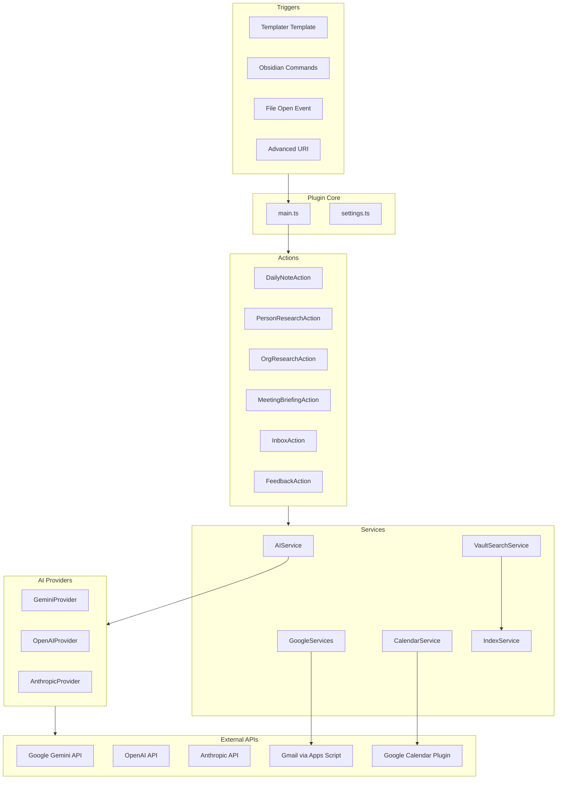

# GetShitDone Plugin

AI-powered research assistant and productivity plugin for Obsidian. Automates research, meeting briefings, and content routing using multiple AI providers (Gemini, OpenAI, Anthropic).

## Features

- **Person Research**: Automatically research people and update their notes with titles, organizations, locations, and research summaries
- **Organization Research**: Deep research on companies with AUM, fund sizes, key people, and portfolio companies
- **Meeting Briefings**: Generate AI-powered briefings for meetings using vault context, attachments, and web search
- **Daily Notes**: Auto-generate daily meeting lists with briefings
- **Inbox Processing**: Smart routing of captured content (tasks, thoughts, references) with trigger phrase detection
- **Multi-Provider AI**: Support for Gemini, OpenAI (GPT-4o, GPT-5, o1/o3), and Anthropic (Claude) models
- **Web Search Integration**: Built-in web search for real-time information gathering

## Architecture

### High-Level Overview

```
┌─────────────────────────────────────────────────────────────┐
│                    Obsidian Plugin Layer                      │
│  (Commands, File Events, Advanced URI, Templater API)        │
└──────────────────────┬──────────────────────────────────────┘
                       │
                       ▼
┌─────────────────────────────────────────────────────────────┐
│                      Plugin Core (main.ts)                   │
│  - Settings Management                                        │
│  - Service Initialization                                     │
│  - Action Orchestration                                       │
└───────────┬─────────────────────────────────────────────────┘
            │
    ┌───────┴────────┬──────────────┬──────────────┐
    ▼                ▼              ▼              ▼
┌─────────┐   ┌──────────┐   ┌──────────┐   ┌──────────┐
│ Actions │   │ Services │   │  Utils   │   │  Types   │
└─────────┘   └──────────┘   └──────────┘   └──────────┘
```

### Component Architecture



## Key Components

### Actions (`src/actions/`)

Actions are the main feature handlers that orchestrate workflows:

- **`PersonResearchAction`**: Researches people, extracts frontmatter (title, org, location), updates notes
- **`OrgResearchAction`**: Researches organizations, creates/updates org notes
- **`MeetingBriefingAction`**: Generates meeting briefings using vault context and web search
- **`DailyNoteAction`**: Generates daily meeting lists, triggers briefings
- **`InboxAction`**: Processes inbox items, routes content, handles trigger phrases
- **`FeedbackAction`**: Collects and manages user feedback for prompt improvement

### Services (`src/services/`)

Services provide reusable functionality:

- **`AIService`**: Router that detects provider from model name and routes to appropriate provider
- **`GeminiProvider`**: Implements `AIProvider` for Google Gemini models
- **`OpenAIProvider`**: Implements `AIProvider` for OpenAI models (GPT-4o, GPT-5, o1/o3)
- **`AnthropicProvider`**: Implements `AIProvider` for Anthropic Claude models
- **`GoogleServices`**: Handles Gmail search and Google Docs reading via Apps Script
- **`CalendarService`**: Wrapper for Google Calendar plugin integration
- **`VaultSearchService`**: Searches vault, parses frontmatter, finds related notes
- **`IndexService`**: Maintains in-memory index for fast lookups

### Utilities (`src/utils/`)

- **`error-handler.ts`**: Standardized error handling with logging and user notifications

### Types (`src/types.ts`)

Central type definitions for:
- Plugin settings
- API responses
- Frontmatter structures
- Action results

## Data Flow

### Person Research Flow

```
1. User triggers research (command/file open)
   ↓
2. PersonResearchAction.researchPerson()
   ↓
3. Gather research data:
   - Gmail communication history
   - Vault context (existing notes)
   ↓
4. AIService.callModel() → Routes to provider
   ↓
5. AI Provider calls API with prompt
   ↓
6. Parse markdown response:
   - Extract frontmatter (Title, Organization, Location)
   - Extract research summary bullets
   ↓
7. Update note:
   - Add/update frontmatter fields
   - Link to organization if found/created
   - Add research summary section
```

### Meeting Briefing Flow

```
1. DailyNoteAction generates meeting list
   ↓
2. MeetingBriefingAction.processMeetingBriefing()
   ↓
3. Gather context:
   - Vault context (related notes)
   - Meeting attachments
   - Previous meeting notes
   ↓
4. AIService.callModel() with web search enabled
   ↓
5. AI generates briefing (1-3 sentences)
   ↓
6. Insert briefing into meeting note
```

### Inbox Processing Flow

```
1. Content arrives via Advanced URI
   ↓
2. InboxAction.processInboxItem()
   ↓
3. Check trigger phrases:
   - "Research" → handleResearchTrigger()
   - "Follow up" → handleFollowupTrigger()
   ↓
4. Check smart suggestions:
   - Detect entity mentions
   - Show modal to add to entity notes
   ↓
5. Route content:
   - AI routing (if enabled) or keyword-based
   - TASK → daily note with due date
   - THOUGHT → daily note thoughts section
   - REFERENCE → daily note thoughts section
   ↓
6. Append to destination
```

## AI Provider Abstraction

The plugin uses a provider abstraction pattern to support multiple AI providers:

### `AIProvider` Interface

```typescript
interface AIProvider {
  callModel(
    system: string,
    user: string,
    model: string,
    options?: AICallOptions
  ): Promise<string | null>;
}
```

### Provider Detection

The `AIService` automatically detects the provider from model name:
- `claude-*` → AnthropicProvider
- `gpt-*`, `o1-*`, `o3-*` → OpenAIProvider
- `gemini-*` → GeminiProvider (default)

### Feature Mapping

| Feature | Gemini | OpenAI | Anthropic |
|---------|--------|--------|-----------|
| Web Search | Google Search | `web_search` tool | `web_search_20250305` tool |
| Reasoning Effort | `thinkingBudget` tokens | `reasoning.effort` (GPT-5) | `output_config.effort` (Opus 4.5) |
| Verbosity | N/A | `verbosity: "low"` (GPT-5) | N/A |

## Configuration

### Required Settings

- **API Keys**: At least one of:
  - Gemini API Key (for Gemini models)
  - OpenAI API Key (for OpenAI models)
  - Anthropic API Key (for Claude models)

### Optional Settings

- **Apps Script URL/Secret**: For Gmail and Google Docs access
- **Folder Paths**: Customize People/, Organizations/, Meetings/ folders
- **Model Selection**: Choose models for each action type
- **Generation Configs**: Temperature, reasoning effort per action
- **Inbox Settings**: Trigger phrases, smart suggestions, routing rules

## Development

### Project Structure

```
getshitdone/
├── src/
│   ├── actions/          # Feature handlers
│   ├── services/         # Reusable services
│   ├── utils/            # Utility functions
│   ├── main.ts           # Plugin entry point
│   ├── settings.ts       # Settings UI
│   └── types.ts          # Type definitions
├── prompts/              # Prompt templates (markdown)
├── scripts/
│   └── generate-prompts.js  # Auto-generates prompts.ts
├── package.json
├── tsconfig.json
└── esbuild.config.mjs
```

### Building

```bash
nvm use
npm install
npm run build
```

Requires Node 20.x (see `.nvmrc`).

The build process:
1. Generates `src/prompts.ts` from markdown files in `prompts/`
2. Compiles TypeScript with esbuild
3. Outputs `main.js` and `manifest.json`

### Development Workflow

1. Edit prompts in `prompts/*.md` files
2. Run `npm run generate-prompts` (or `npm run build`)
3. Make code changes in `src/`
4. Build with `npm run build`
5. Copy `main.js` and `manifest.json` to `.obsidian/plugins/getshitdone/`
6. Reload plugin in Obsidian

### Adding a New AI Provider

1. Create `src/services/{provider}-provider.ts` implementing `AIProvider`
2. Add provider to `AIService`:
   - Import provider
   - Add to constructor
   - Add to `updateSettings()`
   - Update `detectProvider()` method
   - Update `getProvider()` method
3. Add API key setting in `types.ts` and `settings.ts`

### Error Handling

All errors use the standardized error handler (`src/utils/error-handler.ts`):

```typescript
import { handleError, handleErrorWithDefault } from "../utils/error-handler";

try {
  // operation
} catch (error: unknown) {
  handleError("Context: Operation failed", error, {
    showNotice: true,
    noticeMessage: "User-friendly message",
    additionalContext: { key: "value" },
  });
}
```

## Prompt Management

Prompts are stored as markdown files in `prompts/` and auto-generated into `src/prompts.ts`:

- `meeting-filter.md` - Determines if meeting needs briefing
- `meeting-briefing.md` - Generates meeting briefings
- `person-research.md` - Researches people
- `org-research.md` - Researches organizations
- `inbox-routing.md` - Routes inbox content
- `research.md` - Deep research with web search

Edit prompts in markdown, then rebuild to update.

## Dependencies

- **Obsidian API**: Core plugin functionality
- **TypeScript**: Type safety
- **esbuild**: Fast compilation
- **Moment.js**: Date handling (via Obsidian)

## License

MIT

## Author

Maximilian Wühr
